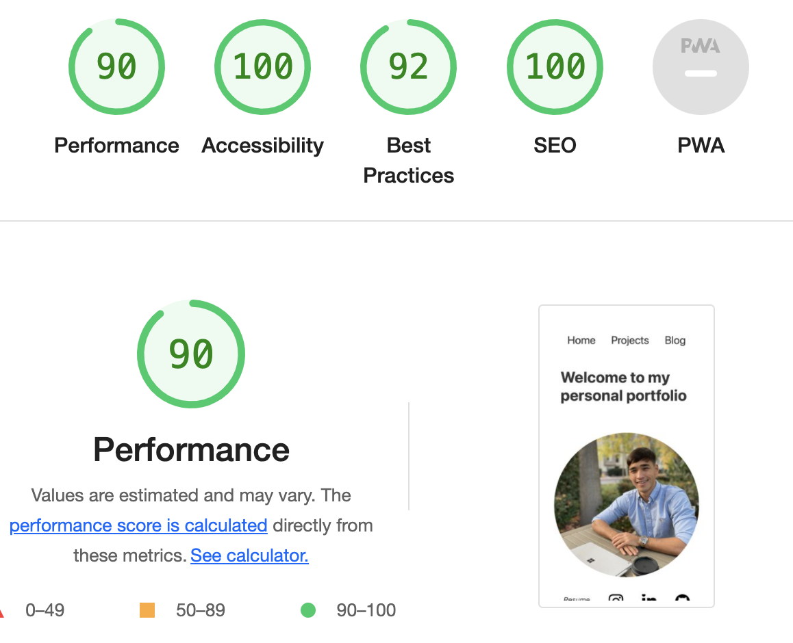

# Changes:

## Phase 3:
* Added google analytics script
* Minor UI changes/content changes, no more animations 

## Phase 4:
* Coverted SVG icons into WebP 
* Revamped pages into template components, per SPA design
* Added footer, contact me section
* Improved responsive design and accessbility through media queries

## Improved Lighthouse report

* Previous lighthouse score was the same, except performance improved from 62.
* I accidently merged so I couldn't get a screenshot of lighthouse on previous version